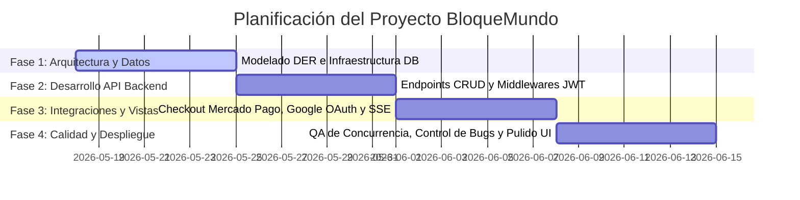
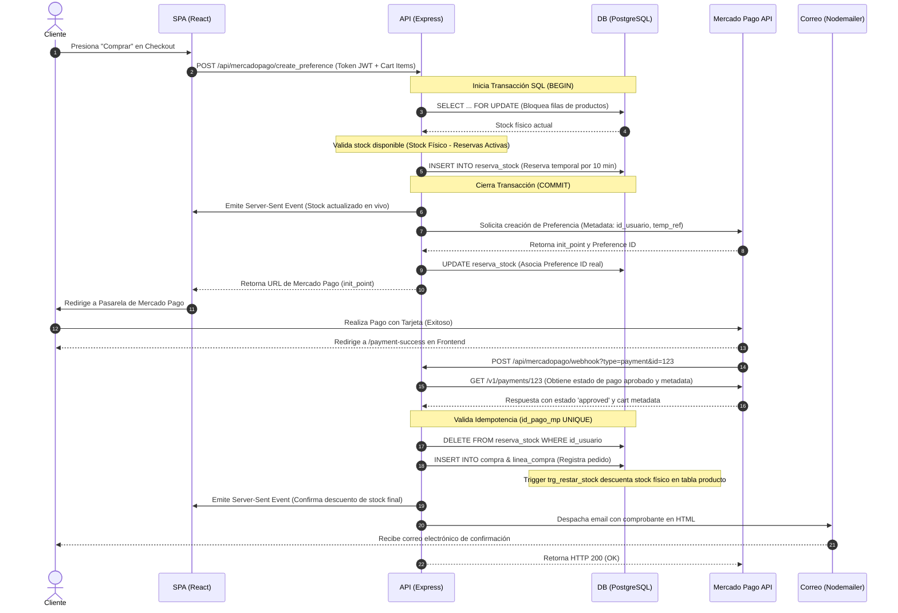

# DOCUMENTACIÓN TÉCNICA OFICIAL: PROYECTO BLOQUEMUNDO
**Cátedra:** Taller de Integración (UADER FCyT)  
**Proyecto:** BloqueMundo - Plataforma E-commerce de Bloques de Construcción con Sincronización en Tiempo Real  

---

## 1. PROBLEMA Y ALCANCE

### 1.1 Problema
La venta informal de juguetes didácticos y bloques de construcción (Lego, Rasti, etc.) suele sufrir de dolores operativos críticos:
*   **Falta de control de inventario unificado:** Vender en múltiples canales físicos y digitales provoca desfases de stock físico.
*   **Problemas de sobreventa (Carreras de competencia):** Dos clientes intentando pagar el último set de Simba disponible simultáneamente. Si no se reserva el producto al iniciar el checkout, el sistema acepta ambos pagos y genera incidentes postventa.
*   **Monitoreo y trazabilidad manual:** Dificultad para asociar envíos con códigos de seguimiento y notificar transacciones por correo electrónico en tiempo real.
*   **Falta de flexibilidad promocional:** Incapacidad de aplicar descuentos globales, por categorías o productos de manera temporal y controlada.

**BloqueMundo** soluciona esto proveyendo una plataforma desacoplada web responsiva con reserva temporal de inventario basada en base de datos relacional, integración con pasarelas de pago y notificaciones por correo, garantizando la consistencia transaccional y la sincronización de stock en tiempo real en los navegadores de los usuarios.

### 1.2 Alcance
El MVP del sistema cubre dos roles principales:

#### Rol Cliente (Frontend de Compra)
*   **Autenticación federada y local:** Registro tradicional, login con JWT y autenticación mediante Google OAuth.
*   **Gestión de Perfil:** Modificación de datos personales, selección de avatar a través de un carrusel premium de personajes Lego predefinidos (cuyas rutas se guardan en BD) y cambio de contraseña local (deshabilitado para usuarios federados de Google OAuth).
*   **Catálogo interactivo:** Filtros alfabéticos, por precio, por rango de edad recomendada, últimos lanzamientos y categorías dinámicas.
*   **Favoritos y Carrito:** Persistencia de favoritos y carrito de compras en la base de datos sincronizada con el estado local.
*   **Checkout con Reserva Transaccional:** Al presionar "Comprar", el sistema bloquea los ítems seleccionados en la base de datos por un límite de 10 minutos (TTL), impidiendo que otros usuarios los adquieran mientras se realiza el pago.
*   **Pasarela de Pago (Mercado Pago):** Redirección transparente al checkout sandbox de Mercado Pago y retorno exitoso, pendiente o fallido.
*   **Historial de Pedidos:** Listado de compras pasadas organizado en secciones ("Pendientes" para compras en curso y "Compras Anteriores" para compras finalizadas/entregadas/rechazadas), con estados de envío actualizados en tiempo real y código de seguimiento.
*   **Calificaciones y Reseñas:** Los usuarios pueden calificar con estrellas y comentar productos, siempre y cuando la cantidad de reseñas escritas sea menor o igual al total comprado de ese ítem (Elegibilidad de Reseñas).

#### Rol Administrador (Backoffice del Operador)
*   **Dashboard Estadístico:** Visualización del ranking de ventas y recaudación consolidada usando vistas materializadas de base de datos.
*   **CRUD de Inventario:** Creación, lectura, actualización y desactivación (baja lógica) de productos y categorías.
*   **Gestión de Imágenes:** Carga múltiple de archivos de imagen por producto, procesados, comprimidos y redimensionados en el backend usando la librería Sharp para optimizar ancho de banda.
*   **Gestión de Promociones:** Panel de control de promociones temporales (porcentaje de descuento) aplicadas a nivel de producto individual o ¿categoría completa?.
*   **Auditoría de Pedidos:** Visualización de todas las compras del sistema, cambio de estado del envío e ingreso manual del código de seguimiento para el correo.

### 1.3 Límites del sistema
Quedan fuera del alcance del actual MVP:
*   Integración automatizada mediante APIs con empresas de logística (OCA/Correo Argentino/Andreani) para cotización dinámica de envíos o generación de etiquetas (los códigos de seguimiento se ingresan manualmente en el Backoffice).
*   Soporte multi-moneda (transacciones únicamente en pesos argentinos ARS).
*   Módulo de facturación fiscal electrónica integrada (AFIP).

---

## 2. REQUERIMIENTOS PRIORIZADOS (MÉTODO MOSCOW)

A continuación se detalla la priorización de requerimientos funcionales utilizando el método MoSCoW.

| ID | Prioridad | Rol Responsable | Regla de Negocio / Funcionalidad Exacta |
| :--- | :--- | :--- | :--- |
| **#A-01** | Must Have | Sistema / Admin | **Baja lógica de productos:** Los productos eliminados no deben borrarse físicamente de la base de datos para no violar restricciones de integridad referencial (`linea_compra`), sino actualizar su columna `activo = false` para excluirlos del catálogo de los clientes. |
| **#A-02** | Must Have | Sistema / Cliente | **Reserva de stock temporal:** Al crear una preferencia de pago en Mercado Pago, el sistema debe reservar las unidades del producto en la tabla `reserva_stock` por 10 minutos. Este stock se resta del disponible en el catálogo del resto de los usuarios. |
| **#A-03** | Must Have | Sistema / Pago | **Control de Idempotencia en Webhooks:** El webhook de Mercado Pago debe validar si el identificador de pago (`id_pago_mp`) ya existe en la tabla `compra` antes de proceder al registro, evitando la duplicación de pedidos y dobles descuentos físicos de stock por reintentos de red de la API. |
| **#A-04** | Must Have | Administrador | **Carga múltiple y optimización de imágenes:** El panel de administración debe permitir subir hasta 5 imágenes simultáneas por producto. El backend debe interceptar el flujo, procesar los buffers con Sharp convirtiéndolos a WebP o formato comprimido y redimensionarlos a una resolución estándar antes de guardarlos. |
| **#A-05** | Must Have | Cliente / Sistema | **Integración de Mercado Pago:** Los clientes deben ser redirigidos de forma segura a Mercado Pago y el sistema debe procesar las notificaciones asíncronas vía Webhooks para consolidar la transacción. |
| **#A-06** | Must Have | Sistema | **Confirmación por correo electrónico:** Tras recibir la confirmación de pago aprobado vía webhook, se debe enviar de forma automática un comprobante detallado en formato HTML al email del cliente utilizando un servicio SMTP. |
| **#S-01** | Should Have | Cliente | **Autenticación federada:** Inicio de sesión ágil con cuentas de Google, integrando el SDK correspondiente y persistiendo el perfil del usuario en la base de datos unificada si es la primera vez que ingresa. |
| **#S-02** | Should Have | Sistema / Cliente | **Sincronización de Stock en Vivo (SSE):** El inventario disponible en el catálogo se debe actualizar en tiempo real mediante Server-Sent Events (SSE) cuando ocurran compras aprobadas o reservas temporales de otros usuarios, previniendo decepciones al clickear un producto sin stock disponible real. |
| **#S-03** | Should Have | Cliente | **Gestión de Direcciones y Localidades:** El usuario debe poder vincular a su cuenta su dirección de entrega (Calle, Número) asociada a una localidad preexistente con su Código Postal respectivo para validar zonas de despacho. |
| **#C-01** | Could Have | Cliente | **Elegibilidad estricta de Reseñas:** Un cliente solo puede calificar y comentar un producto si lo ha comprado previamente (compra en estado distinto de 'Esperando Pago' o 'Cancelado') y la cantidad de reseñas que ya realizó de ese producto es menor a la cantidad total de unidades adquiridas de dicho producto. |
| **#C-02** | Could Have | Administrador | **Estadísticas en Backoffice:** Dashboard con reportes dinámicos de ranking de ventas y recaudación general a partir de las vistas agregadas de PostgreSQL. |
| **#W-01** | Won't Have | Sistema / Logística | **Cálculo dinámico de tarifa de envío:** Integración con la API de Correo Argentino para cotizar costos de envío en tiempo real basados en volumen, peso y CP de destino. |

---

## 3. REQUERIMIENTOS NO FUNCIONALES

*   **Arquitectura Desacoplada:** Frontend y Backend deben estar completamente separados físicamente. El Frontend se comunica con el Backend únicamente a través de peticiones HTTP RESTful y conexiones de eventos unidireccionales (SSE).
*   **Interfaz de Usuario Responsiva (UI/Responsive):** Estética premium utilizando fuentes modernas (Inter/Outfit), microanimaciones e interactividad avanzada. El diseño debe adaptarse a anchos de pantalla desde 320px (móviles) hasta resoluciones de escritorio (UltraWide), garantizando legibilidad y áreas táctiles adecuadas.
*   **Seguridad:**
    *   **Autenticación y Autorización:** Implementada mediante tokens JSON Web Tokens (JWT) firmados digitalmente. Adicionalmente, el servidor cuenta con una guardia de arranque fatal que verifica la presencia de la variable `JWT_SECRET` en las variables de entorno, deteniendo el proceso de inicio si no se encuentra configurada.
    *   **Middleware Guards:** Bloqueo de rutas de API en backend (`verificarToken` y `verificarAdmin`) y componentes de enrutamiento en React (`AdminRoute`).
    *   **Prevención de Inyección SQL:** Todas las interacciones con la base de datos se realizan a través del pool de `pg` parametrizando obligatoriamente los argumentos de las consultas SQL (`$1, $2, ...`).
    *   **Rate Limiter:** Limitador de tasa estricto en rutas sensibles (`/api/auth/*` y `/api/mercadopago/create_preference`) permitiendo un máximo de 50 peticiones por ventana de 15 minutos por dirección IP para evitar ataques de fuerza bruta y denegación de servicios.
*   **Persistencia:** Base de datos PostgreSQL relacional con soporte nativo para transacciones concurrentes. Uso estricto de cláusulas de aislamiento transaccional y bloqueos explícitos de filas (`SELECT ... FOR UPDATE`) en operaciones críticas de verificación de stock físico.
*   **Rendimiento:**
    *   Las imágenes de catálogo subidas por el administrador son comprimidas mediante Sharp, limitando el tamaño a un máximo de 300KB por imagen para optimizar los tiempos de carga del frontend.
    *   Sincronización en tiempo real del stock mediante una única conexión persistente de Server-Sent Events (SSE) por cliente, evitando encuestas periódicas (polling) que degradan el rendimiento de la CPU del servidor.
*   **Integración de Terceros:** Conexión segura con la API de Mercado Pago mediante su SDK v2, Google Identity Services para inicio de sesión federado y Nodemailer con soporte SSL/TLS para el despacho de correos.
*   **Despliegue y Portabilidad:** Modularidad total mediante el uso de variables de entorno definidas en archivos `.env` (puertos, credenciales de base de datos, tokens de APIs y URLs de redirección), facilitando la migración rápida entre entornos locales y servidores en la nube.

---

## 4. CASOS DE USO Y ESPECIFICACIONES

A continuación se especifican las interacciones críticas de negocio del sistema.

### CU01: Autenticación de Usuario (Login / Registro / Google OAuth)
*   **Actor Principal:** Cliente / Administrador.
*   **Precondiciones:** El usuario no debe estar autenticado en la sesión actual del navegador.
*   **Flujo Principal:**
    1.  El usuario accede a la pantalla de Login y elige iniciar sesión de forma local (ingresando Email y Contraseña) o federada (Google).
    2.  *Opción Local:* Ingresa sus datos. El sistema valida el formato de email, cifra la contraseña introducida y la compara con la almacenada (`bcryptjs`).
    3.  *Opción Google:* Selecciona su cuenta de Google. El SDK del cliente retorna un token de identidad (credential JWT) que se despacha al endpoint de backend `/api/auth/google-login`.
    4.  El backend valida la firma de Google. Si el correo no existe en el sistema, registra automáticamente un nuevo usuario asociando su nombre, apellido, correo y un avatar por defecto.
    5.  El backend genera un JWT firmado con el ID del usuario, su rol y email, y lo retorna al cliente.
    6.  El frontend almacena el token en `localStorage` o `sessionStorage`, actualiza el estado global de `AppContext` e inicializa la sincronización del carrito.
*   **Flujos Alternativos / Excepciones:**
    *   **Contraseña incorrecta:** El sistema retorna código HTTP 401 y muestra un toast en pantalla informando que las credenciales son inválidas.
    *   **Rate limit excedido:** Si la IP realiza más de 50 intentos en 15 minutos, el middleware responde con HTTP 429 bloqueando la conexión.
*   **Postcondiciones:** El usuario dispone de un token JWT válido para consumir endpoints protegidos y el menú del frontend expone su panel de cuenta.

### CU02: Gestión de Carrito y Checkout con Reserva Temporal
*   **Actor Principal:** Cliente.
*   **Precondiciones:** El cliente debe estar autenticado y tener al menos un ítem con stock disponible en su carrito.
*   **Flujo Principal:**
    1.  El cliente ingresa a la vista del Carrito y presiona "Iniciar Pago" o realiza una compra directa. Su correo electrónico estará bloqueado y no será editable por motivos de consistencia de cuenta.
    2.  El frontend despacha los ítems de compra a `/api/mercadopago/create_preference`.
    3.  El backend inicia una transacción de base de datos (`BEGIN`).
    4.  El backend elimina cualquier reserva activa previa del usuario para esos productos para evitar acumular bloqueos espurios.
    5.  Para cada ítem, ejecuta un bloqueo de fila (`SELECT stock FROM producto WHERE id_producto = $1 FOR UPDATE`) y calcula el stock disponible restando la suma de las reservas vigentes en la tabla `reserva_stock`.
    6.  Si hay disponibilidad, crea un registro de reserva temporal en `reserva_stock` con un TTL de 10 minutos y asocia una clave UUID de referencia temporal (`temp_ref`).
    7.  El backend consolida la transacción (`COMMIT`).
    8.  El servidor emite un evento SSE informando a todos los clientes conectados que el stock disponible de esos productos ha disminuido.
    9.  El backend crea la preferencia de pago en la API de Mercado Pago inyectando los ítems, datos del cliente y los metadatos de control (`temp_ref`, `id_usuario`, ítems de compra).
    10. El backend actualiza el campo `mp_preference_id` de la reserva en la base de datos con el ID retornado por Mercado Pago.
    11. El frontend guarda localmente los IDs de los productos de la compra (`purchased_item_ids`) en `sessionStorage` para permitir la posterior limpieza selectiva del carrito local.
    12. El frontend recibe la URL de inicio del pago y redirige al cliente a la pasarela de Mercado Pago.
*   **Flujos Alternativos / Excepciones:**
    *   **Stock insuficiente detectado en el backend:** Se ejecuta `ROLLBACK` de la transacción. El backend retorna HTTP 400 con un mensaje detallando el producto que se quedó sin stock. El cliente visualiza un modal advirtiendo del cambio y se cancela la redirección.
*   **Postcondiciones:** El stock físico se mantiene intacto, pero el stock lógico disminuye temporalmente mediante un bloqueo en `reserva_stock`. Se abre la interfaz de pago de Mercado Pago.

### CU03: Procesamiento de Pago y Confirmación (Webhook MP)
*   **Actor Principal:** Sistema (Mercado Pago API) / Cliente.
*   **Precondiciones:** Se ha detonado una reserva de stock previa y el usuario completa exitosamente el pago en Mercado Pago.
*   **Flujo Principal:**
    1.  Mercado Pago despacha una notificación POST asíncrona al endpoint `/api/mercadopago/webhook` con el ID del pago.
    2.  El controlador del backend solicita el detalle del pago a Mercado Pago utilizando el SDK de Payment.
    3.  Al validar que el estado del pago es `approved`, el backend inicia la lógica de confirmación.
    4.  Se comprueba la idempotencia: busca si ya existe el `id_pago_mp` en la tabla `compra`. Si no existe, prosigue.
    5.  Si la compra no fue directa, vacía el registro de líneas de carrito del usuario de manera selectiva (removiendo solo los productos comprados guardados en `sessionStorage`), sincronizando posteriormente el carrito en el servidor.
    6.  Busca los metadatos del pago, obtiene el listado de productos y cantidades compradas.
    7.  Elimina los registros en `reserva_stock` asociados al usuario y productos del checkout (ya no se requiere la reserva temporal).
    8.  Inserta la cabecera del pedido en `compra` y sus líneas en `linea_compra` en un bloque transaccional.
    9.  La base de datos ejecuta el trigger `trg_restar_stock` restando de forma física y definitiva el stock del producto físico en la tabla `producto`.
    10. El servidor emite una notificación de actualización de stock a través de Server-Sent Events (SSE) para reflejar el estado final en todos los navegadores activos.
    11. Se dispara el servicio Nodemailer para despachar el comprobante HTML de compra con el detalle de los precios al correo electrónico registrado.
    12. El backend responde HTTP 200 a Mercado Pago.
*   **Flujos Alternativos / Excepciones:**
    *   **Pago ya procesado (Idempotencia):** Si el `id_pago_mp` ya existe en la base de datos, el backend registra el evento en logs, omite duplicar compras u operaciones de stock y retorna HTTP 200 inmediatamente a Mercado Pago.
    *   **Pago fallido, rechazado o cancelado (Procesamiento de Pago Fallido):** Si el estado del pago reportado por la pasarela es `rejected` o `cancelled` (recibido por webhook o reportado de forma síncrona por el frontend en la redirección de fallo al endpoint `/api/mercadopago/procesar-pago-fallido`):
        1. Se valida la idempotencia buscando si ya existe el ID de pago en la tabla `compra`.
        2. El backend obtiene el detalle del pago utilizando la API de Mercado Pago.
        3. El backend elimina las reservas asociadas en `reserva_stock` para liberar el stock disponible y emite las notificaciones SSE de stock correspondientes.
        4. Para registrar la transacción en el historial de compras de auditoría, se inserta el pedido con estado `'Esperando Pago'` (descontando el stock físico mediante triggers) y, acto seguido, se actualiza su estado a `'Cancelado'` (provocando la restauración del stock físico en base de datos de manera limpia, dejando el registro como Cancelado/Rechazado).
*   **Postcondiciones:** La compra se registra en base de datos, el stock físico del producto queda disminuido, la reserva temporal es eliminada de forma limpia y el cliente recibe su comprobante por correo.

---

## 5. PLANIFICACIÓN Y METODOLOGÍA

### 5.1 Metodología de Trabajo
Se utilizó un framework ágil de **Scrum adaptado** a las necesidades de la cátedra, estructurado en **4 Sprints semanales**.
*   **Sprints de 7 días:** Estableciendo objetivos de desarrollo concretos al inicio de cada semana.
*   **Reuniones de Sincronización:** Para resolver bloqueos de código, integrar módulos backend con vistas frontend y unificar políticas de persistencia.
*   **Control de Versiones y Pull Requests:** Uso sistemático de ramas de desarrollo y revisión cruzada de código antes de su combinación en la rama estable.

### 5.2 Planificación por Fases


### 5.3 Detalle Cronológico de Sprints
*   **Sprint 1 (Semana 1): Cimientos del Negocio y Base de Datos**
    *   *Entregables:* Diseño físico y lógico de la base de datos PostgreSQL. Creación de scripts SQL y definición de tablas base (`usuario`, `producto`, `categoria`, `imagen`, `carrito`, `linea_carrito`).
    *   *Lógica backend:* Inicialización del servidor Express en Node.js, configuración de pool de conexiones concurrentes a Supabase. Desarrollo del registro de usuario local y encriptación con bcryptjs.
*   **Sprint 2 (Semana 2): Catálogo Dinámico y Gestión de Inventario**
    *   *Entregables:* Maquetado del catálogo frontend responsivo con filtros dinámicos por edad, precio y categorías.
    *   *Lógica backend:* Implementación de rutas CRUD de productos para el administrador. Integración del middleware de subida de archivos Multer en memoria. Integración de la librería Sharp para compresión de archivos de imagen y redimensionamiento dinámico.
    *   *Bugs corregidos:* Pérdida de calidad en imágenes de catálogo grandes (solucionado forzando compresión con ratio de calidad fijo en Sharp).
*   **Sprint 3 (Semana 3): Integración de Pagos, OAuth y SSE**
    *   *Entregables:* Flujo de checkout de Mercado Pago operativo, flujo de inicio de sesión seguro con Google OAuth (Google Identity Services API) e integración de SSE (Server-Sent Events) en el frontend.
    *   *Lógica backend:* Creación de las preferencias de Mercado Pago y endpoint de recepción de notificaciones Webhooks. Mapeo lógico y creación de la tabla de reservas de stock `reserva_stock` para bloquear productos durante la pasarela de pago.
    *   *Wow Factors:* Desarrollo del canal SSE (`/api/stream/stock`) que emite eventos instantáneos a los clientes para refrescar stock al registrar reservas o cancelaciones.
*   **Sprint 4 (Semana 4): Control de Concurrencia, Calificaciones e Idempotencia**
    *   *Entregables:* Bloqueos concurrentes en BD para la reserva de stock (`SELECT FOR UPDATE`), control de elegibilidad en reseñas de usuarios, módulo de envío de emails transaccionales y corrección de bugs críticos.
    *   *Bugs corregidos:* Duplicidad de compras por múltiples llamados del Webhook de Mercado Pago (solucionado implementando restricción UNIQUE en la columna `id_pago_mp` y validación de existencia antes de insertar).

### 5.4 Herramientas de Gestión
*   **Notion:** Seguimiento visual del backlog de requerimientos a través de tarjetas kanban asignando estados "Por hacer", "En progreso" y "Completado".
*   **GitHub:** Control de versiones, ramas, resolución de conflictos de combinación y registro histórico del repositorio.
*   **Postman:** Pruebas unitarias de endpoints, simulación manual de payloads de peticiones REST y verificación de la estructura de respuestas.
*   **Beekeeper Studio / pgAdmin:** Cliente de base de datos para inspección de tablas, depuración de triggers y optimización de índices relacionales en Supabase.
*   **Mailtrap / SMTP Sandbox:** Entorno simulado de pruebas de correo electrónico para asegurar la correcta renderización HTML de los comprobantes de compra.

---

## 6. REPOSITORIO DEL PROYECTO

### 6.1 Estructura y Organización de Ramas
El repositorio oficial del proyecto sigue una metodología simplificada de GitFlow para asegurar la estabilidad del software:
1.  `main`: Contiene el código estable listo para producción. Cada cambio integrado aquí representa una versión probada y funcional del software.
2.  `develop`: Contiene las características nuevas agregadas durante el sprint en etapa de pruebas integradas. 

#### Políticas de `.gitignore`
Se implementó un archivo `.gitignore` estricto en la raíz del proyecto para evitar la subida de información sensible, dependencias o basura del entorno:
```gitignore
# Dependencias locales
node_modules/
frontend/node_modules/

# Variables de entorno y credenciales
.env
frontend/.env

# Archivos de subidas locales (imágenes temporales)
src/public/uploads/*
!src/public/uploads/.gitkeep

# Archivos de logs y depuración del sistema
npm-debug.log*
yarn-debug.log*
.DS_Store
```

#### Manejo de Variables de Entorno (Archivo `.env` Backend)
El archivo `.env` de desarrollo define los parámetros críticos de inicialización local:
```env
PORT=3000
DB_USER=postgres
DB_HOST=aws-0-sa-east-1.pooler.supabase.com
DB_DATABASE=postgres
DB_PASSWORD=contrasenia_secreta_supabase
DB_PORT=6543
JWT_SECRET=super_secure_token_firmas_2026_key_123
MP_ACCESS_TOKEN=TEST-3392476566418854-052018-971c261e47963df50d890d2354c4d7e9-1823758368
MP_WEBHOOK_URL=https://tutel-seguro-ngrok-free.app/api/mercadopago/webhook
FRONTEND_URL=http://localhost:5173
EMAIL_HOST=smtp.gmail.com
EMAIL_PORT=465
EMAIL_USER=soporte.bloquemundo@gmail.com
EMAIL_PASS=clave_aplicacion_gmail
```

---

## 7. PRESENTACIÓN TÉCNICA DEL PROYECTO

### 7.1 Tecnologías Implementadas

#### Frontend (Aplicación de Cliente)
*   **React 19:** Framework de JavaScript declarativo basado en componentes interactivos, que permite un renderizado sumamente eficiente del DOM.
*   **Vite 8:** Herramienta de compilación (bundler) ultrarrápida que optimiza el proceso de desarrollo local y reduce drásticamente el peso de la build de producción.
*   **React Router DOM v7:** Enrutador dinámico que permite la transición entre páginas sin recargar la página entera (Single Page Application - SPA).
*   **Vanilla CSS:** Hojas de estilo puras, aplicando variables CSS globales para el tema oscuro/claro, flexbox y rejillas CSS Grid. Garantiza velocidad y total libertad de diseño.
*   **Swiper & React Fast Marquee:** Librerías dinámicas utilizadas para carruseles de imágenes de alta fidelidad y marquesinas fluidas de promociones en la home.

#### Backend (Servidor de API)
*   **Node.js & Express 5:** Entorno de ejecución y framework minimalista para el manejo de rutas, peticiones HTTP RESTful y la gestión de peticiones SSE de forma asíncrona.
*   **Multer 2:** Middleware para la gestión de solicitudes multipart/form-data, permitiendo la recepción temporal de archivos de imagen subidos al servidor.
*   **Sharp:** Procesador de imágenes de alto rendimiento que comprime y redimensiona buffers de archivos en memoria antes de la persistencia para optimizar el almacenamiento.
*   **Nodemailer 8:** Librería robusta para el envío seguro de correos electrónicos transaccionales usando SMTP con cifrado SSL/TLS.
*   **Bcryptjs & Jsonwebtoken:** Criptografía y tokens de sesión para autenticación segura.

#### Base de Datos e Infraestructura
*   **PostgreSQL 16 (Alojado en Supabase):** Motor de base de datos relacional de nivel empresarial con soporte nativo de triggers en PL/pgSQL y control avanzado de transacciones ACID.

---

### 7.2 Descripción de la Arquitectura
El sistema implementa una **Arquitectura desacoplada en Tres Capas Lógicas**, lo que independiza la interfaz de usuario de las políticas de almacenamiento físico y reglas transaccionales de negocio.

```
+-------------------------------------------------------------+
|                     CAPA DE PRESENTACIÓN                    |
|                React 19 / Vite / Vanilla CSS                |
+------------------------------------+------------------------+
                                     | Peticiones HTTP
                                     | Server-Sent Events (SSE)
                                     v
+-------------------------------------------------------------+
|                      CAPA DE NEGOCIO                        |
|            Express 5 Controllers & Middlewares             |
+------------------------------------+------------------------+
                                     | Queries SQL Parametrizadas
                                     | BEGIN / COMMIT / ROLLBACK
                                     v
+-------------------------------------------------------------+
|                     CAPA DE PERSISTENCIA                    |
|             PostgreSQL / Triggers / PL/pgSQL                |
+-------------------------------------------------------------+
```

#### Capa de Presentación (Frontend)
Responsable única de la experiencia de usuario (UX). Renderiza las vistas basadas en el estado global administrado por `AppContext`. Utiliza llamadas asíncronas con fetch a la API del backend para persistir cambios y se conecta al canal SSE para escuchar actualizaciones de inventario en tiempo real sin realizar encuestas al servidor.

#### Capa de Negocio (Backend)
Contiene las reglas del negocio. Los enrutadores asocian endpoints específicos con controladores (`authController`, `productoController`, `mercadoPagoController`, etc.) y middlewares de seguridad (`authMiddleware` y `adminMiddleware`). Esta capa se encarga de estructurar las transacciones SQL, interactuar con APIs externas (Mercado Pago, Google) e inyectar el control de concurrencia a través de bloqueos físicos.

#### Capa de Persistencia (Base de Datos)
Constituida por las tablas físicas de PostgreSQL. Ejecuta reglas de integridad referencial rígidas (llaves foráneas en cascada o restricción en eliminación), vistas consolidadas para analíticas y automatizaciones lógicas mediante disparadores (triggers) que recalculan carritos (`fn_actualizar_total_carrito`) y modifican stocks de forma atómica al confirmar ventas.

---

### 7.3 Flujo de Comunicación
A continuación se detalla el ciclo de vida de una petición crítica de compra y webhook de confirmación.



---

## 8. MODELO DE DATOS DER (DIAGRAMA ENTIDAD - RELACIÓN)

### 8.1 Estructura del Modelo Relacional
La base de datos relacional PostgreSQL cuenta con las siguientes tablas físicas, llaves primarias, llaves foráneas y triggers configurados para asegurar la integridad de datos:

#### Restricciones de Integridad y Triggers:
1.  **Cálculo Automático del Carrito (`trg_actualizar_carrito`):** Cualquier inserción, actualización o eliminación en la tabla `linea_carrito` dispara la función `fn_actualizar_total_carrito()`, la cual calcula automáticamente la sumatoria de `cantidad * precio` y actualiza la columna `total` de la fila correspondiente en la tabla `carrito`.
2.  **Validación de Stock antes de Compra (`trg_validar_stock`):** Antes de insertar una fila en `linea_compra`, se dispara `fn_validar_stock_antes_compra()`, impidiendo la transacción si la cantidad solicitada supera el stock físico de la tabla `producto`.
3.  **Descuento Físico del Inventario (`trg_restar_stock`):** Tras insertar la fila en `linea_compra`, el trigger `trg_restar_stock` ejecuta `fn_restar_stock_compra()`, la cual resta físicamente del stock disponible del producto la cantidad comprada.
4.  **Baja Lógica sobre Física:** El borrado de productos se realiza a través de la columna `activo` de la tabla `producto` en lugar de una consulta `DELETE`, manteniendo el histórico referencial en `linea_compra` sin romper las llaves foráneas.

---

### 8.2 Diccionario de Datos

#### Tabla: `usuario`
Representa las cuentas registradas en el sistema.

| Atributo | Dominio | Nulo | Valor por Defecto | Rango Válido | Clave | Descripción |
| :--- | :--- | :--- | :--- | :--- | :--- | :--- |
| `id_usuario` | SERIAL (Integer) | No | auto-incremental | >= 1 | PK | Identificador único del usuario. |
| `nombre` | VARCHAR(50) | No | - | - | - | Nombre del usuario. |
| `apellido` | VARCHAR(50) | No | - | - | - | Apellido del usuario. |
| `email` | VARCHAR(255) | No | - | Formato email único | UK | Correo electrónico institucional o personal. |
| `contrasena` | VARCHAR(255) | No | - | Hash de bcrypt | - | Clave de acceso cifrada. |
| `telefono` | VARCHAR(20) | Sí | NULL | - | - | Teléfono de contacto opcional. |
| `rol` | ENUM ('usuario', 'admin')| No | 'usuario' | - | - | Rol para control de acceso (Guards). |
| `id_direccion` | INTEGER | Sí | NULL | FK ref `direccion` | FK, UK | Dirección de residencia del usuario. |
| `fecha_registro`| TIMESTAMP | No | NOW() | - | - | Fecha y hora de creación de la cuenta. |
| `avatar_url` | VARCHAR(255) | Sí | '/images/logo mario.png'| - | - | Ruta o URL del avatar de personaje Lego seleccionado por el usuario. |

#### Tabla: `producto`
Catálogo físico de sets de construcción en venta.

| Atributo | Dominio | Nulo | Valor por Defecto | Rango Válido | Clave | Descripción |
| :--- | :--- | :--- | :--- | :--- | :--- | :--- |
| `id_producto` | SERIAL (Integer) | No | auto-incremental | >= 1 | PK | Identificador único del producto. |
| `nombre` | VARCHAR(100) | No | - | - | - | Nombre comercial del set. |
| `descripcion` | TEXT | Sí | NULL | - | - | Detalles y especificaciones del producto. |
| `id_categoria` | INTEGER | No | - | FK ref `categoria`| FK | Vínculo con la categoría del catálogo. |
| `edad_recomendada`| INTEGER | Sí | NULL | > 0 | - | Edad mínima sugerida para el uso del set. |
| `precio` | NUMERIC(10,2) | No | - | >= 0.00 | - | Precio unitario de lista. |
| `activo` | BOOLEAN | No | TRUE | - | - | Flag para habilitación lógica en catálogo. |
| `stock` | INTEGER | No | 0 | >= 0 | - | Cantidad física real disponible en bodega. |
| `ultimo_lanzamiento`| BOOLEAN | Sí | FALSE | - | - | Determina si se expone en novedades. |

#### Tabla: `categoria`
Clasificación de productos (ej: Lego, Star Wars, Rasti).

| Atributo | Dominio | Nulo | Valor por Defecto | Rango Válido | Clave | Descripción |
| :--- | :--- | :--- | :--- | :--- | :--- | :--- |
| `id_categoria` | SERIAL (Integer) | No | auto-incremental | >= 1 | PK | Identificador de categoría. |
| `nombre` | VARCHAR(50) | No | - | Único | UK | Nombre de la categoría. |

#### Tabla: `imagen`
Mapeo de URLs de imágenes asociadas a un producto.

| Atributo | Dominio | Nulo | Valor por Defecto | Rango Válido | Clave | Descripción |
| :--- | :--- | :--- | :--- | :--- | :--- | :--- |
| `id_imagen` | SERIAL (Integer) | No | auto-incremental | >= 1 | PK | ID único de imagen. |
| `id_producto` | INTEGER | No | - | FK ref `producto` | FK | Relación con el producto. |
| `url` | VARCHAR(500) | No | - | - | - | Ruta o URL de almacenamiento de la imagen. |
| `descripcion` | VARCHAR(255) | Sí | NULL | - | - | Texto alternativo o descripción. |

#### Tabla: `carrito`
Estado persistido del carrito activo por usuario.

| Atributo | Dominio | Nulo | Valor por Defecto | Rango Válido | Clave | Descripción |
| :--- | :--- | :--- | :--- | :--- | :--- | :--- |
| `id_carrito` | SERIAL (Integer) | No | auto-incremental | >= 1 | PK | ID del carrito. |
| `id_usuario` | INTEGER | No | - | FK ref `usuario` | FK, UK | Usuario dueño de este carrito único. |
| `total` | NUMERIC(10,2) | No | 0.00 | >= 0.00 | - | Monto acumulado calculado por trigger. |

#### Tabla: `linea_carrito`
Ítems específicos agregados al carrito de un usuario.

| Atributo | Dominio | Nulo | Valor por Defecto | Rango Válido | Clave | Descripción |
| :--- | :--- | :--- | :--- | :--- | :--- | :--- |
| `id_carrito` | INTEGER | No | - | FK ref `carrito` | PK, FK | Vínculo al carrito cabecera. |
| `id_producto` | INTEGER | No | - | FK ref `producto` | PK, FK | Producto seleccionado. |
| `cantidad` | INTEGER | No | - | > 0 | - | Cantidad seleccionada. |
| `precio` | NUMERIC(10,2) | No | - | >= 0.00 | - | Precio unitario al momento de añadir. |

#### Tabla: `compra`
Cabecera histórica de pedidos consolidados.

| Atributo | Dominio | Nulo | Valor por Defecto | Rango Válido | Clave | Descripción |
| :--- | :--- | :--- | :--- | :--- | :--- | :--- |
| `id_compra` | SERIAL (Integer) | No | auto-incremental | >= 1 | PK | Identificador único de compra. |
| `id_usuario` | INTEGER | No | - | FK ref `usuario` | FK | Cliente comprador. |
| `fecha` | TIMESTAMP | No | NOW() | - | - | Fecha de transacción consolidada. |
| `metodo_pago` | VARCHAR(50) | No | 'mercado_pago' | - | - | Pasarela seleccionada. |
| `estado` | estado_compra (ENUM) | No | 'Esperando Pago' | - | - | Estado del pedido. Valores: 'Pendiente', 'Pago aprobado', 'En proceso', 'Pedido despachado', 'Finalizado', 'Cancelado', 'Rechazado' (y sus equivalentes heredados). |
| `subtotal` | NUMERIC(10,2) | No | 0.00 | >= 0.00 | - | Suma neta de ítems. |
| `total_descuento`| NUMERIC(10,2) | No | 0.00 | >= 0.00 | - | Descuento total aplicado. |
| `total` | NUMERIC(10,2) | No | - | >= 0.00 | - | Pago total del pedido. |
| `id_pago_mp` | VARCHAR(100) | Sí | NULL | Único | UK | Identificador único devuelto por MP. |

#### Tabla: `linea_compra`
Detalle de productos facturados en una compra.

| Atributo | Dominio | Nulo | Valor por Defecto | Rango Válido | Clave | Descripción |
| :--- | :--- | :--- | :--- | :--- | :--- | :--- |
| `id_compra` | INTEGER | No | - | FK ref `compra` | PK, FK | Vínculo a la cabecera del pedido. |
| `id_producto` | INTEGER | No | - | FK ref `producto` | PK, FK | Producto adquirido. |
| `cantidad` | INTEGER | No | - | > 0 | - | Unidades compradas. |
| `precio` | NUMERIC(10,2) | No | - | >= 0.00 | - | Precio unitario facturado. |
| `id_promo` | INTEGER | Sí | NULL | FK ref `promocion`| FK | Promoción aplicada al ítem. |

#### Tabla: `reserva_stock`
Bloqueos de stock lógico durante el proceso de checkout.

| Atributo | Dominio | Nulo | Valor por Defecto | Rango Válido | Clave | Descripción |
| :--- | :--- | :--- | :--- | :--- | :--- | :--- |
| `id_reserva` | SERIAL (Integer) | No | auto-incremental | >= 1 | PK | ID de la reserva. |
| `id_usuario` | INTEGER | Sí | NULL | FK ref `usuario` | FK | Usuario que posee la reserva. |
| `id_producto` | INTEGER | Sí | NULL | FK ref `producto` | FK | Producto reservado temporalmente. |
| `cantidad` | INTEGER | No | - | > 0 | - | Unidades bloqueadas temporalmente. |
| `fecha_creacion`| TIMESTAMP | Sí | NOW() | - | - | Timestamp de inicio de checkout. |
| `fecha_expiracion`| TIMESTAMP | No | - | - | - | Expiración (10 min desde creación). |
| `mp_preference_id`| VARCHAR(255) | Sí | NULL | - | - | ID de preferencia generado en Mercado Pago. |

#### Tabla: `direccion`
Domicilio físico de envíos.

| Atributo | Dominio | Nulo | Valor por Defecto | Rango Válido | Clave | Descripción |
| :--- | :--- | :--- | :--- | :--- | :--- | :--- |
| `id_direccion` | SERIAL (Integer) | No | auto-incremental | >= 1 | PK | ID de dirección de entrega. |
| `calle` | VARCHAR(150) | No | - | - | - | Nombre de la calle. |
| `numero` | INTEGER | No | - | > 0 | - | Altura catastral. |
| `id_localidad` | INTEGER | No | - | FK ref `localidad`| FK | Localidad donde se encuentra. |

#### Tabla: `localidad`
Catálogo de ciudades de despacho con sus códigos postales.

| Atributo | Dominio | Nulo | Valor por Defecto | Rango Válido | Clave | Descripción |
| :--- | :--- | :--- | :--- | :--- | :--- | :--- |
| `id_localidad` | SERIAL (Integer) | No | auto-incremental | >= 1 | PK | ID de localidad. |
| `nombre` | VARCHAR(100) | No | - | - | - | Nombre de la ciudad/barrio. |
| `cp` | VARCHAR(10) | No | - | - | - | Código Postal. |

#### Tabla: `promocion`
Descuentos porcentuales temporales del negocio.

| Atributo | Dominio | Nulo | Valor por Defecto | Rango Válido | Clave | Descripción |
| :--- | :--- | :--- | :--- | :--- | :--- | :--- |
| `id_promo` | SERIAL (Integer) | No | auto-incremental | >= 1 | PK | ID de promoción. |
| `descripcion` | VARCHAR(200) | No | - | - | - | Detalle de la oferta. |
| `fecha_inicio` | DATE | No | - | - | - | Comienzo de la validez. |
| `fecha_fin` | DATE | No | - | >= `fecha_inicio` | - | Vencimiento de la oferta. |
| `porcentaje` | NUMERIC(5,2) | No | - | 0.00 a 100.00 | - | Ratio de rebaja sobre el precio. |
| `id_producto` | INTEGER | Sí | NULL | FK ref `producto` | FK | Producto afectado (opcional). |
| `id_categoria` | INTEGER | Sí | NULL | FK ref `categoria`| FK | Categoría afectada (opcional). |

#### Tabla: `calificacion`
Puntuaciones con estrellas asignadas por clientes.

| Atributo | Dominio | Nulo | Valor por Defecto | Rango Válido | Clave | Descripción |
| :--- | :--- | :--- | :--- | :--- | :--- | :--- |
| `id_calificacion`| SERIAL (Integer) | No | auto-incremental | >= 1 | PK | ID de calificación. |
| `id_usuario` | INTEGER | No | - | FK ref `usuario` | FK | Autor del puntaje. |
| `id_producto` | INTEGER | No | - | FK ref `producto` | FK | Producto calificado. |
| `puntaje` | INTEGER | No | - | 1 al 5 | - | Puntuación numérica otorgada (estrellas). |
| `fecha` | DATE | No | CURRENT_DATE | - | - | Fecha de registro. |

#### Tabla: `comentario`
Mensajes adjuntos a puntuaciones redactados por usuarios.

| Atributo | Dominio | Nulo | Valor por Defecto | Rango Válido | Clave | Descripción |
| :--- | :--- | :--- | :--- | :--- | :--- | :--- |
| `id_comentario` | SERIAL (Integer) | No | auto-incremental | >= 1 | PK | ID del comentario. |
| `id_usuario` | INTEGER | No | - | FK ref `usuario` | FK | Autor del comentario. |
| `id_producto` | INTEGER | No | - | FK ref `producto` | FK | Producto sobre el cual se opina. |
| `texto` | TEXT | No | - | - | - | Comentario textual. |
| `fecha` | DATE | No | CURRENT_DATE | - | - | Fecha del comentario. |
| `anonimo` | BOOLEAN | No | FALSE | - | - | Flag para ocultar nombre de usuario. |
| `respuesta_adm` | TEXT | Sí | NULL | - | - | Respuesta redactada por el operador. |
| `id_calificacion`| INTEGER | Sí | NULL | FK ref `calificacion`| FK | Vinculación a la estrella del comentario. |

#### Tabla: `favorito`
Listado de productos deseados por usuario.

| Atributo | Dominio | Nulo | Valor por Defecto | Rango Válido | Clave | Descripción |
| :--- | :--- | :--- | :--- | :--- | :--- | :--- |
| `id_usuario` | INTEGER | No | - | FK ref `usuario` | PK, FK | Usuario que marca como favorito. |
| `id_producto` | INTEGER | No | - | FK ref `producto` | PK, FK | Producto deseado. |

#### Tabla: `envio`
Datos de envío y despacho logístico de compras.

| Atributo | Dominio | Nulo | Valor por Defecto | Rango Válido | Clave | Descripción |
| :--- | :--- | :--- | :--- | :--- | :--- | :--- |
| `id_envio` | SERIAL (Integer) | No | auto-incremental | >= 1 | PK | ID de envío. |
| `id_compra` | INTEGER | No | - | FK ref `compra` | FK, UK | Pedido asociado a despachar. |
| `codigo_seguimiento`| VARCHAR(80) | Sí | NULL | - | - | Código manual del correo. |

---

## 9. ESTRUCTURA DE CARPETAS DEL PROYECTO

Árbol de directorios real del espacio de trabajo del proyecto BloqueMundo:

```
BloqueMundo (Directorio Raíz)
├── .env                          # Variables de entorno críticas de backend
├── .gitignore                    # Reglas de exclusión de Git
├── README.md                     # Guía básica del proyecto
├── alter.js                      # Script auxiliar de base de datos
├── alter_producto_activo.js      # Script de alteración para baja lógica de producto
├── package.json                  # Dependencias y scripts de backend
├── scripts/                      # Scripts para administración y migraciones de BD
│   ├── alter_compra_idempotencia.js # Script para implementar id_pago_mp UNIQUE
│   ├── check_db_functions.js     # Script para listar funciones y triggers en Supabase
│   ├── check_tables.js           # Inspección de tablas en la base de datos
│   ├── clean_duplicate_purchase.js # Script saneador para revertir compras duplicadas
│   └── update_real_descriptions.sql # Datos reales e históricos para catálogo
├── scratch/                      # Scripts e información temporal de desarrollo
│   ├── dump_schema.js            # Extractor del esquema de tablas en Supabase
│   ├── schema_dump.json          # Dump de metadatos de la base de datos
│   ├── alter_enum.js             # Agrega 'Pago aprobado' al enum estado_compra
│   ├── simulate_failed_payment.js # Simulación y registro de un pago rechazado/cancelado
│   ├── check_latest_compras.js   # Script para consultar las compras más recientes
│   ├── check_mp_payments.js      # Script de consulta de pagos en la API de Mercado Pago
│   ├── query_db.js               # Consultas auxiliares de base de datos
│   └── test_trigger_locally.js   # Script para probar triggers locales
├── src/                          # Directorio fuente del Backend
│   ├── app.js                    # Inicializador de Express, Cron y SSE
│   ├── config/                   # Parámetros de infraestructura
│   │   └── db.js                 # Pool de conexiones pg con SSL
│   ├── controllers/              # Controladores de lógica de negocio
│   │   ├── authController.js     # Lógica de registro, login y Google OAuth
│   │   ├── carritoController.js  # Lógica de carritos y reserva de stock
│   │   ├── compraController.js   # Historial y auditoría de pedidos
│   │   ├── direccionController.js # Direcciones de envío y localidades
│   │   ├── favoritoController.js  # Gestión de lista de deseados
│   │   ├── mercadoPagoController.js # Preferencias, webhook e redirecciones
│   │   ├── productoController.js # Productos, categorías y reseñas
│   │   └── promocionController.js # Panel de promociones dinámicas
│   ├── middlewares/              # Interceptores de peticiones HTTP
│   │   ├── adminMiddleware.js    # Verificador del rol 'admin'
│   │   └── authMiddleware.js     # Verificador y decodificador del JWT
│   ├── models/                   # Capa de abstracción de base de datos
│   │   ├── carritoModel.js       # Operaciones SQL del carrito
│   │   ├── compraModel.js        # Operaciones SQL de compras y líneas
│   │   ├── direccionModel.js     # Operaciones SQL de calles y direcciones
│   │   ├── favoritoModel.js      # Operaciones SQL de productos deseados
│   │   ├── productoModel.js      # Consultas SQL del catálogo e inventario
│   │   └── reservaModel.js       # Reservas dinámicas en checkout
│   ├── public/                   # Archivos estáticos servidos
│   │   └── uploads/              # Imágenes subidas procesadas por Sharp
│   └── utils/                    # Funciones y utilidades de soporte
│       ├── emailService.js       # Configuración SMTP y plantilla HTML
│       └── sseController.js      # Manejador de conexiones Server-Sent Events
└── frontend/                     # Directorio de la aplicación SPA
    ├── package.json              # Dependencias de Vite y React
    ├── vite.config.js            # Configuración de compilador Vite
    └── src/                      # Directorio fuente del Frontend
        ├── App.jsx               # Enrutamiento, ScrollToTop y Sincronización de ruta
        ├── index.css             # Estilos CSS de la aplicación
        ├── main.jsx              # Punto de entrada de React
        ├── components/           # Componentes UI reutilizables
        │   ├── AdminRoute/       # Enrutador protegido por rol admin
        │   ├── ConfirmModal/     # Modales de confirmación interactivos
        │   ├── Footer/           # Pie de página dinámico
        │   ├── Navbar/           # Barra de navegación principal
        │   ├── ProductCard/      # Tarjeta del producto para el catálogo
        │   └── ScrollToTop/      # Reset del scroll en navegación
        ├── context/              # Manejo del estado global
        │   └── AppContext.jsx    # Manejo unificado de Auth, Carrito, Favoritos y SSE
        └── pages/                # Vistas principales del sistema
            ├── About/            # Sección institucional "Nosotros"
            ├── Account/          # Panel personal del cliente
            ├── Admin/            # Panel de Administración (Backoffice)
            │   ├── AdminDashboard.jsx # Dashboard de entrada del admin
            │   └── components/   # Secciones (AdminOrders, AdminProducts, AdminPromotions)
            ├── Cart/             # Visualización del Carrito
            ├── Catalog/          # Catálogo completo con barra de búsqueda y filtros
            ├── Checkout/         # Formulario de pago, domicilio y redirección
            ├── Home/             # Página de inicio con banners y novedades
            ├── NotFound/         # Página de error 404 personalizada
            ├── PaymentStatus/    # Respuestas de Mercado Pago (Success/Failure/Pending)
            └── ProductDetail/    # Vista ampliada, múltiples imágenes y reseñas
```

---

## 10. DEFINICIÓN DE ENDPOINTS DE API

| Recurso / Módulo | Método | URL | Función Técnica | Acceso | Seguridad (Guards/JWT) |
| :--- | :--- | :--- | :--- | :--- | :--- |
| **Autenticación** | `POST` | `/api/auth/register` | Registra usuario localmente. | Público | Sin credenciales. |
| **Autenticación** | `POST` | `/api/auth/login` | Loguea usuario localmente. | Público | Sin credenciales. |
| **Autenticación** | `POST` | `/api/auth/google-login`| Autentica mediante token OAuth de Google. | Público | Sin credenciales. |
| **Autenticación** | `PUT` | `/api/auth/profile` | Actualiza datos del perfil. | Privado | JWT (`verificarToken`). |
| **Autenticación** | `PUT` | `/api/auth/avatar` | Selecciona un avatar predefinido de Lego. | Privado | JWT (`verificarToken`). |
| **Autenticación** | `PUT` | `/api/auth/password` | Cambia la contraseña cifrada. | Privado | JWT (`verificarToken`). |
| **Productos** | `GET` | `/api/productos` | Obtiene catálogo activo. | Público | Sin credenciales. |
| **Productos** | `GET` | `/api/productos/:id` | Detalle del producto e imágenes. | Público | Sin credenciales. |
| **Productos** | `GET` | `/api/productos/:id/resenas` | Comentarios del producto. | Público | Sin credenciales. |
| **Productos** | `GET` | `/api/productos/:id/elegibilidad-resena` | Verifica si puede comentar. | Privado | JWT (`verificarToken`). |
| **Productos** | `POST` | `/api/productos/:id/calificar` | Crea calificación y reseña. | Privado | JWT (`verificarToken`). |
| **Productos (Admin)** | `GET` | `/api/productos/admin` | Lista productos (incluye inactivos). | Admin | JWT + Admin Middleware. |
| **Productos (Admin)** | `POST` | `/api/productos` | Crea producto con hasta 5 imágenes. | Admin | JWT + Admin + Multer Buffer. |
| **Productos (Admin)** | `PUT` | `/api/productos/:id` | Edita producto e imágenes. | Admin | JWT + Admin + Multer Buffer. |
| **Productos (Admin)** | `DELETE`| `/api/productos/:id` | Borrado lógico (`activo = false`). | Admin | JWT + Admin Middleware. |
| **Categorías (Admin)**| `GET` | `/api/productos/categorias/admin` | Trae todas las categorías. | Admin | JWT + Admin Middleware. |
| **Categorías (Admin)**| `POST` | `/api/productos/categorias/admin` | Crea nueva categoría. | Admin | JWT + Admin Middleware. |
| **Categorías (Admin)**| `PUT` | `/api/productos/categorias/admin/:id`| Modifica nombre de categoría. | Admin | JWT + Admin Middleware. |
| **Categorías (Admin)**| `DELETE`| `/api/productos/categorias/admin/:id`| Elimina categoría vacía. | Admin | JWT + Admin Middleware. |
| **Carrito** | `GET` | `/api/carrito` | Obtiene el carrito del usuario. | Privado | JWT (`verificarToken`). |
| **Carrito** | `POST` | `/api/carrito/add` | Agrega un producto al carrito. | Privado | JWT (`verificarToken`). |
| **Carrito** | `PUT` | `/api/carrito/update` | Modifica cantidad en el carrito. | Privado | JWT (`verificarToken`). |
| **Carrito** | `POST` | `/api/carrito/remove` | Remueve ítem del carrito. | Privado | JWT (`verificarToken`). |
| **Carrito** | `POST` | `/api/carrito/clear` | Vacía el carrito del usuario. | Privado | JWT (`verificarToken`). |
| **Dirección** | `GET` | `/api/direccion` | Obtiene la dirección del usuario. | Privado | JWT (`verificarToken`). |
| **Dirección** | `GET` | `/api/direccion/localidades`| Obtiene listado de localidades y CP.| Público | Sin credenciales. |
| **Dirección** | `POST` | `/api/direccion` | Guarda/actualiza dirección. | Privado | JWT (`verificarToken`). |
| **Dirección** | `DELETE`| `/api/direccion` | Elimina la dirección de la cuenta. | Privado | JWT (`verificarToken`). |
| **Favoritos** | `GET` | `/api/favoritos` | Listado de favoritos del usuario. | Privado | JWT (`verificarToken`). |
| **Favoritos** | `POST` | `/api/favoritos` | Añade producto a favoritos. | Privado | JWT (`verificarToken`). |
| **Favoritos** | `DELETE`| `/api/favoritos` | Quita producto de favoritos. | Privado | JWT (`verificarToken`). |
| **Compras** | `GET` | `/api/compras` | Historial de compras del usuario. | Privado | JWT (`verificarToken`). |
| **Compras (Admin)** | `GET` | `/api/compras/admin` | Lista todas las compras del sistema. | Admin | JWT + Admin Middleware. |
| **Compras (Admin)** | `PUT` | `/api/compras/admin/:id/estado`| Modifica estado y código de envío. | Admin | JWT + Admin Middleware. |
| **Promociones** | `GET` | `/api/promociones` | Lista promociones de administrador.| Admin | JWT + Admin Middleware. |
| **Promociones** | `POST` | `/api/promociones` | Crea descuento por producto/categoría| Admin | JWT + Admin Middleware. |
| **Promociones** | `PUT` | `/api/promociones/:id` | Modifica descuento promocional. | Admin | JWT + Admin Middleware. |
| **Promociones** | `DELETE`| `/api/promociones/:id` | Elimina descuento promocional. | Admin | JWT + Admin Middleware. |
| **Mercado Pago** | `POST` | `/api/mercadopago/create_preference` | Crea preferencia y reserva stock. | Privado | JWT (`verificarToken`). |
| **Mercado Pago** | `POST` | `/api/mercadopago/webhook` | Recibe confirmaciones de pago. | Público | Sin credenciales (seguro). |
| **Mercado Pago** | `POST` | `/api/mercadopago/procesar-pago-fallido` | Registra compra fallida y libera reservas de stock. | Privado | JWT (`verificarToken`). |
| **Server-Sent Events**| `GET` | `/api/stream/stock` | Flujo de eventos de stock. | Público | Sin credenciales. |

---

## 11. QA Y RESULTADOS DE PRUEBAS

### 11.1 Estrategia y Entorno
El control de calidad se estructuró bajo el enfoque de **Caja Negra / End-to-End (E2E)** en condiciones que simulan redes del mundo real:
*   **Túnel Seguro de Ngrok:** Se orquestó un túnel ngrok para redireccionar el puerto de desarrollo local `3000` de forma segura (HTTPS) hacia la web externa. Esto permitió validar la recepción asíncrona real del webhook de Mercado Pago, el cual requiere obligatoriamente una URL segura accesible en internet.
*   **Sandbox de Mercado Pago:** Utilización de cuentas vendedoras y compradoras simuladas de Mercado Pago Sandbox con tarjetas de crédito de prueba del sitio oficial para simular escenarios aprobados, rechazados y pendientes de acreditación.
*   **Mailtrap Sandbox:** Simulación de envío de correos, comprobando la recepción de plantillas HTML en bandeja de entrada ficticia.

---

### 11.2 Escenarios y Matrices de Pruebas

#### Caso 1: Flujo Normal Exitoso de Compra
*   **Condición inicial:** Producto "Simba Lego" cuenta con 10 unidades físicas en stock. No hay reservas activas.
*   **Acción:** El usuario agrega 2 unidades al carrito e inicia el pago. Se le redirige a Mercado Pago y abona con tarjeta aprobada.
*   **Resultado esperado:**
    1.  Al iniciar checkout, el stock disponible cae a 8 unidades (reflejado en otros navegadores instantáneamente vía SSE).
    2.  En base de datos se crea un registro en `reserva_stock` por 2 unidades vinculadas a la preferencia.
    3.  Al procesar el Webhook de Mercado Pago, la reserva en `reserva_stock` se elimina.
    4.  Se inserta el pedido en `compra`.
    5.  El stock físico del producto en `producto` se actualiza automáticamente en la base de datos a 8 unidades mediante el trigger de stock.
    6.  Se recibe el correo de comprobante.
*   **Estado:** **Aprobado**.

#### Caso 2: Expiración de Reserva de Stock
*   **Condición inicial:** Producto "Simba Lego" cuenta con 5 unidades físicas en stock.
*   **Acción:** El usuario inicia el checkout por 3 unidades (el stock lógico baja instantáneamente a 2 mediante SSE). El usuario cierra el navegador o abandona la pasarela de pago sin completar la transacción.
*   **Resultado esperado:**
    1.  En base de datos queda el registro en `reserva_stock` con validez de 10 minutos.
    2.  Transcurridos los 10 minutos, el cron de Node.js se activa (corre cada minuto en `app.js`).
    3.  La consulta `DELETE` elimina la reserva expirada.
    4.  El stock lógico vuelve a incrementarse a 5 unidades de forma automática.
    5.  Se emite una actualización por SSE y los catálogos de los usuarios conectados muestran el stock original de 5 unidades.
*   **Estado:** **Aprobado**.

#### Caso 3: Prueba de Concurrencia Extrema (Edge Case)
*   **Condición inicial:** Producto "Castillo Lego" cuenta con 1 sola unidad física de stock.
*   **Acción:** Dos clientes (Usuario A y Usuario B) tienen el castillo en su carrito simultáneamente e intentan hacer click en "Comprar" al mismo tiempo (con milisegundos de diferencia).
*   **Resultado esperado:**
    1.  La base de datos recibe el llamado de A. Ejecuta `SELECT ... FOR UPDATE` bloqueando la fila del producto.
    2.  La base de datos recibe el llamado de B. Al intentar el `FOR UPDATE`, se bloquea y espera que la transacción de A complete.
    3.  La petición de A crea la reserva temporal con éxito y ejecuta `COMMIT`. El stock disponible para "Castillo Lego" pasa a ser 0.
    4.  Se libera el bloqueo y se ejecuta el llamado de B. Al evaluar el stock disponible (Stock Físico 1 - Reserva de A 1 = 0 disponible), se dispara la validación lógica en base de datos.
    5.  La petición de B arroja una excepción de stock insuficiente.
    6.  La transacción de B hace `ROLLBACK` seguro. El cliente B visualiza en su interfaz un mensaje advirtiendo que no hay stock disponible y no es redirigido a Mercado Pago.
*   **Estado:** **Aprobado**.

---

## 12. INFORME DE DEFECTOS

### Defecto 1: Compras Duplicadas en el Webhook de Mercado Pago
*   **Tipo:** Lógico / Integración.
*   **Gravedad:** Crítica (Afectaba directamente el inventario físico y la contabilidad transaccional).
*   **Descripción del fallo:** Debido a microcortes de red de internet o latencia en la respuesta HTTP `200` que el backend debe devolver a Mercado Pago, la plataforma de Mercado Pago reintentaba despachar el webhook por segunda vez para la misma compra. Esto causaba que el backend volviera a ejecutar el flujo de inserción de compra, duplicando el registro y cobrando dos veces el stock físico del producto.
*   **Solución Técnica:**
    1.  Se alteró la tabla `compra` mediante un script de migración, añadiendo la columna `id_pago_mp` como un campo VARCHAR único (`UNIQUE`).
    2.  Se añadió un paso de validación por idempotencia en el controlador del webhook: antes de iniciar la inserción, el sistema realiza la consulta `SELECT id_compra FROM compra WHERE id_pago_mp = $1`. Si arroja algún resultado, se detiene la ejecución del bloque, se genera un log y se responde con HTTP `200 OK` al servidor de Mercado Pago, descartando el webhook duplicado.

```javascript
// Implementación de idempotencia en mercadoPagoController.js
const { rows: existingCompra } = await pool.query(
    'SELECT id_compra FROM compra WHERE id_pago_mp = $1',
    [String(paymentId)]
);
if (existingCompra.length > 0) {
    console.log(`Pago ${paymentId} ya procesado. Ignorando webhook duplicado.`);
    return res.sendStatus(200);
}
```

### Defecto 2: Violación de Integridad Referencial al Eliminar Productos
*   **Tipo:** Integración de Datos / Persistencia.
*   **Gravedad:** Alta (Provocaba caídas del servidor al lanzar excepciones no controladas de clave foránea).
*   **Descripción del fallo:** Cuando un operador administrador deseaba eliminar del catálogo un set de lego descontinuado que un cliente ya había comprado anteriormente, la base de datos lanzaba una excepción violando la integridad de clave foránea en la tabla `linea_compra`. Si el producto era borrado físicamente, el historial de compras del usuario quedaba huérfano.
*   **Solución Técnica:**
    1.  Se eliminó el borrado físico (`DELETE FROM producto`) en el controlador de productos y se implementó un sistema de **Baja Lógica**.
    2.  Se añadió la columna `activo` (booleano por defecto `true`) en la tabla `producto` mediante el script `alter_producto_activo.js`.
    3.  El controlador del administrador ejecuta ahora una consulta de tipo `UPDATE producto SET activo = false WHERE id_producto = $1`.
    4.  Se ajustaron las consultas del catálogo público para incluir el filtro `WHERE p.activo = true`, manteniendo el producto visible únicamente en el Backoffice e historiales de compra del usuario.

---

## 13. MANUAL DE USUARIO

Experiencia secuencial de navegación para el cliente final de BloqueMundo:

1.  **Registro y Autenticación:**
    *   Ingrese al sitio y haga click en "Iniciar Sesión" (esquina superior derecha).
    *   Puede optar por crear una cuenta local rellenando el formulario de registro, o pulsar "Iniciar sesión con Google".
2.  **Explorar el Catálogo:**
    *   Acceda a la barra "Productos" para abrir el catálogo.
    *   Use la barra lateral de filtros: puede ingresar palabras clave en la búsqueda, filtrar por edad (ej: 9-12 años), o marcar categorías (ej: "Lego Star Wars").
    *   Haga click en la tarjeta de un producto para abrir la vista ampliada de detalles, ver la galería de imágenes secundarias y revisar la puntuación con estrellas de otros compradores.
3.  **Gestión de Favoritos y Carrito:**
    *   En cada tarjeta de producto, puede pulsar el icono del corazón para agregarlo a su lista personal de deseados.
    *   Seleccione la cantidad deseada del set de construcción y presione "Agregar al Carrito".
    *   El icono del carrito en el navbar mostrará un globo con la cantidad de ítems seleccionados.
4.  **Proceso de Compra (Checkout):**
    *   Vaya a la página de Carrito e ingrese al Checkout. Su correo electrónico estará bloqueado y no será editable por motivos de consistencia de cuenta.
    *   El sistema le solicitará completar los datos de entrega: ingrese Calle, Altura y seleccione su Localidad correspondiente.
    *   Haga click en "Proceder al Pago". Se le redirigirá al formulario seguro de Mercado Pago. En este punto, los identificadores de los ítems de compra se almacenan temporalmente en la sesión (`sessionStorage` bajo `purchased_item_ids`) para realizar una limpieza selectiva de los productos comprados de su carrito local una vez confirmado el pago.
    *   Rellene las credenciales de tarjeta de crédito. Al confirmarse el pago, Mercado Pago lo devolverá de forma automática a la pantalla de éxito de BloqueMundo.
5.  **Post-Venta y Reseñas:**
    *   Haga click en su nombre en la esquina superior para acceder a "Mi Cuenta". Allí verá su historial de compras organizado en dos pestañas/secciones: "Pendientes" (para compras en curso o esperando pago) e "Historial" (para compras finalizadas, entregadas, canceladas o rechazadas).
    *   Las compras canceladas o rechazadas por la pasarela de pago figurarán con la etiqueta `'Rechazado'` en su historial personal.
    *   Podrá ver detalles de seguimiento y copiar el código de seguimiento de envío provisto por el correo.
    *   En la vista de cada producto que haya comprado, se desbloqueará el formulario de calificación. Puede escribir una reseña, calificar el producto de 1 a 5 estrellas, y elegir si prefiere publicarlo de forma anónima.

---

## 14. MANUAL DEL ADMINISTRADOR

Guía paso a paso para el operador del Backoffice/Panel de Control:

1.  **Acceso al Panel:**
    *   Inicie sesión en el sistema utilizando una cuenta con rol 'admin'.
    *   En el menú de usuario, pulse el botón "Panel de Admin" (redirige a `/admin`).
2.  **Administrar Inventario (CRUD):**
    *   **Crear Producto:** Ingrese a "Productos" y pulse "Crear Producto". Complete Nombre, Categoría, Precio, Stock Físico inicial y Edad Sugerida. Arrastre hasta 5 imágenes en el selector de archivos. Pulse "Guardar". El backend optimizará automáticamente las fotos mediante Sharp.
    *   **Editar Producto:** Pulse el botón de edición en cualquier producto. Podrá cambiar precios, stocks e incluso marcar o desmarcar imágenes existentes para borrarlas del registro de fotos.
    *   **Baja lógica:** Si desea retirar un producto de catálogo de forma permanente, pulse el icono del tacho de basura en la lista. Su estado pasará a "Inactivo" en el panel y desaparecerá del catálogo público.
3.  **Gestión de Descuentos (Promociones):**
    *   Vaya a "Promociones". Haga click en "Nueva Promoción".
    *   Defina una descripción corta, el porcentaje de descuento (ej: 15%), la fecha de inicio y finalización del beneficio, y asóciela opcionalmente a un producto individual o a una categoría completa de juguetes.
4.  **Auditoría y Despacho de Pedidos:**
    *   Ingrese a "Pedidos". Se listará cada compra registrada en la base de datos con la hora, email del comprador, total facturado y estado del pedido.
    *   Las compras con estado `'Cancelado'` o `'Rechazado'` (mostradas como `'Rechazado'`) no podrán ser modificadas (el botón de edición de estado se oculta).
    *   El operador administrador no está autorizado a cambiar manualmente el estado de una compra a `'Cancelado'` o `'Rechazado'` desde el Backoffice (esta acción arroja un error y no está disponible en las opciones del menú de selección).
    *   Al despachar el paquete físico por el correo, haga click en "Editar" sobre el pedido del cliente (siempre que el estado sea elegible), cambie el estado a "Pedido despachado" (o valor de correo equivalente) e introduzca el código de seguimiento impreso por la empresa postal.

---

## 15. MANUAL DEL DESARROLLADOR

### 15.1 Requisitos Previos
*   **Node.js:** Versión 18.x o superior.
*   **npm:** Versión 9.x o superior.
*   **PostgreSQL:** Servidor local o acceso a instancia en la nube (ej: Supabase).

### 15.2 Instalación y Configuración Paso a Paso
1.  **Clonar el repositorio:**
    ```bash
    git clone https://github.com/francofrachia/Taller_De_Integracion.git BloqueMundo
    cd BloqueMundo
    ```
2.  **Instalar dependencias del Backend (Raíz):**
    ```bash
    npm install
    ```
3.  **Instalar dependencias del Frontend:**
    ```bash
    cd frontend
    npm install
    cd ..
    ```
4.  **Configurar variables de entorno:**
    *   Duplique el archivo `.env.example` en la raíz del proyecto, llámelo `.env` y complete los valores correctos de acceso a la base de datos Supabase, tokens de Mercado Pago y puerto de inicialización.

### 15.3 Inicialización y Persistencia

#### 1. Correr la Base de Datos
Si configura un servidor PostgreSQL local, inicialice la estructura de tablas corriendo los scripts SQL del directorio `scripts/` o configure la cadena de conexión del `.env` apuntando a su instancia en Supabase.

#### 2. Lanzar el Servidor Backend (API)
En la raíz del proyecto, lance el entorno de desarrollo:
```bash
npm start
# O si dispone de nodemon:
npx nodemon src/app.js
```
El servidor se inicializará exponiendo su API en: `http://localhost:3000`.

#### 3. Iniciar el Túnel de Webhooks (Requerido para Mercado Pago)
Mercado Pago requiere una URL segura con protocolo HTTPS para notificar transacciones. En una nueva consola, lance ngrok:
```bash
ngrok http 3000
```
Copie la URL generada (`https://xxxx.ngrok-free.app`) y configúrela en el parámetro `MP_WEBHOOK_URL` del archivo `.env` del backend (ej: `MP_WEBHOOK_URL=https://xxxx.ngrok-free.app/api/mercadopago/webhook`), luego reinicie el servidor de Express.

#### 4. Lanzar la Aplicación Frontend (SPA)
Acceda a la carpeta de frontend e inicie el servidor de desarrollo Vite:
```bash
cd frontend
npm run dev
```
La interfaz de usuario estará accesible en su navegador web en `http://localhost:5173`.

---

## 16. INFORME DE CIERRE

### 16.1 Análisis de Desvíos y Cronograma
A continuación se detalla la comparativa en semanas entre las fases planificadas del proyecto y la ejecución real.

| Fase del Proyecto | Estimación | Ejecución Real | Desvío | Justificación del Desvío |
| :--- | :--- | :--- | :--- | :--- |
| **Fase 1: Datos y DER** | 1 semana | 1 semana | 0 semanas | Ejecución según cronograma. Estructura base completada a tiempo. |
| **Fase 2: Backend y API** | 1 semana | 1.2 semanas | +0.2 semanas | Leve atraso debido al acople de Multer con Sharp para compresión de múltiples imágenes en memoria. |
| **Fase 3: Integraciones y Vistas**| 1 semana | 0.8 semanas | -0.2 semanas | Integración ágil de la pasarela de pago de Mercado Pago usando el SDK oficial v2. |
| **Fase 4: QA, Bugs y Cierre** | 1 semana | 1 semana | 0 semanas | Pruebas de concurrencia y despliegue finalizados en la fecha pautada. |

### 16.2 Conclusión, Lecciones Aprendidas y "Wow Factors"

#### Conclusión
El desarrollo de **BloqueMundo** consolida una solución web de comercio electrónico moderna, rápida e íntegra. El uso de tecnologías ampliamente probadas en el mercado laboral (Express, React 19, Supabase) junto a políticas de seguridad estrictas (Guards JWT) y un manejo dinámico del estado del stock garantizan una plataforma confiable.

#### Lecciones Aprendidas
*   **Tratamiento de Concurrencia:** Se aprendió la importancia de utilizar reservas dinámicas asociadas a TTLs de expiración y bloqueos físicos explícitos en BD (`FOR UPDATE`) en lugar de depender únicamente del stock físico final al consolidar el checkout.
*   **Idempotencia Transaccional:** La integración de sistemas externos (APIs) siempre requiere implementar llaves de idempotencia en la base de datos debido a la naturaleza impredecible de las conexiones de red de internet.

#### Wow Factors Técnicos Incorporados
1.  **Sincronización en tiempo real vía SSE:** El catálogo público de juguetes se actualiza instantáneamente en los navegadores de los usuarios cuando cambia el stock gracias a la conexión Server-Sent Events permanente.
2.  **Reserva de Stock Transaccional con TTL:** Mecanismo integrado de reserva por 10 minutos al iniciar checkout, evitando compras cruzadas y sobreventas.
3.  **Procesamiento y compresión Sharp en vivo:** Las imágenes pesadas del panel de administrador se transforman automáticamente en buffers optimizados antes de ser guardadas, reduciendo en un 70% el peso final de la web.
4.  **Triggers de Base de Datos Dinámicos:** Totalización inmediata del carrito mediante el trigger `trg_actualizar_carrito` y consistencia estricta de stock mediante `trg_restar_stock`.

### 16.3 Propuestas de integración futuras (Fase II)
*   **Integración dinámica de logística:** Incorporar el cálculo automatizado de tarifas y generación de etiquetas de despacho conectándose con la API de Correo Argentino.
*   **Recomendador inteligente de compras:** Módulo básico de inteligencia de datos que sugiera sets de construcción complementarios basados en las categorías más visitadas o favoritos guardados del usuario.
*   **Módulo de Cupones de Marketing:** Códigos alfanuméricos de descuento de un solo uso por cliente con fechas de vigencia configurables.
